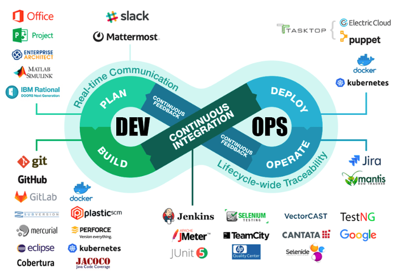
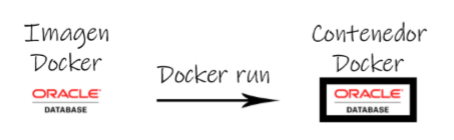

% DevOps, Docker y Kubernetes
% Juan Antonio Paredes León
% Curso 2018/19

# Introducción 

## Resumen

Debido al desconocimiento que hay de uno de los perfiles más demandados de la actualidad, **DevOps**, en este proyecto se va definir el significado del término y su relación con un administrador de sistemas, así como dos de las herramientas más utilizadas en la actualidad por los mismos, **Docker y Kubernetes**.

## Justificación

Actualmente en el mundo laboral, ser administrador de sistemas tal y como lo conocemos no es suficiente. Todo se está empezando a mover a la nube, las cosas necesitan estar listas "ya" y la disponibilidad tiene que ser absoluta.

El administrador de sistemas tiene que evolucionar hacia un método de trabajo conocido como DevOps.

Tras terminar el ciclo y encontrarme en mundo laboral, vi que no sabía realmente que era un DevOps, de Docker sabía lo básico y Kubernetes era un desconocido. Por eso pienso que estos conocimientos son necesarios y de ahí la realización de este proyecto.

## Objetivos principales

- Explicar que es un DevOps.

- Explicar qué es y cómo funciona Docker.

- Explicar qué es y cómo funciona Kubernetes.

# Definiciones

## DevOps I

 Definición según [Atlassian](https://es.atlassian.com/devops) : 
 
*"DevOps es un conjunto de prácticas que automatizan los procesos entre los equipos de desarrollo de software y TI para que puedan compilar, probar y publicar software con mayor rapidez y fiabilidad. El concepto de DevOps se basa en establecer una cultura de colaboración entre equipos que, tradicionalmente, trabajaban en grupos aislados."*

## DevOps II

Como vemos, es una forma de trabajo. Pero, ¿Qué busca una empresa cuando quiere contratar un DevOps?

Lo que se entiende por DevOps en el mundo laboral es una persona que conoce y maneja todas las tecnologías para implementar esta forma de trabajo. 

Como decía la definición, un DevOps automatiza los procesos entre los equipos de desarrollo para agilizar y facilitar el trabajo. Y aquí encontramos el siguiente termino, la integración continua.

## Integración continua I

La integración continua (continuous integration en inglés) es un modelo informático propuesto inicialmente por [Martin Fowler](https://es.wikipedia.org/wiki/Martin_Fowler)  que consiste en hacer integraciones automáticas de un proyecto lo más a menudo posible para así poder detectar fallos cuanto antes. Entendemos por integración la compilación y ejecución de pruebas de todo un proyecto. 

Podríamos decir que la función de lo que se entiende por “DevOps” es facilitar todo el entorno necesario para llevar a cabo un modelo de integración continua.

## Integración continua II

## Docker I

 

La idea detrás de Docker es crear contenedores ligeros y portables para las aplicaciones software que puedan ejecutarse en cualquier máquina en la que esté instalado, independientemente del sistema operativo que la máquina tenga por debajo, facilitando así también los despliegues. 

## Docker II

Uno de los errores más extendidos a la hora de hablar de Docker es que se piensa que es una máquina virtual. Esto no es así, como podemos ver en la siguiente imagen:

 

## Docker III

- Se pueden “arrancar” en fracciones de segundo, en lugar de minutos.

- Pueden ocupar MB en lugar de GB en disco. 

- Se pueden ejecutar de 10 a 100 veces más contenedores que máquinas virtuales en el mismo equipo.

## Docker IV

La tecnología Docker usa el kernel de Linux y las funciones de este, como Cgroups (grupos de control, permiten limitar y distribuir el uso de recursos de sistema como la CPU, memoria, red o disco) y namespaces (espacio de nombres, es un medio para organizar clases dentro de un entorno) para segregar los procesos, de modo que puedan ejecutarse de manera independiente. 

El propósito de los contenedores es esta independencia: la capacidad de ejecutar varios procesos y aplicaciones por separado para hacer un mejor uso de su infraestructura y, al mismo tiempo, conservar la seguridad que tendría con sistemas separados. 

## Docker V

 Docker funciona con imágenes y contenedores. Para que se entienda de una manera más sencilla, podríamos decir que las imágenes de Docker son moldes, y cuando arrancamos un contenedor a partir de una imagen, hacemos una impresión de ese molde: 
 
  
 
 Podemos hacer todos los contenedores que necesitemos. Además, interactúan entre ellos.
 
## Kubernetes

 

Kubernetes (K8S) es un orquestador de contenedores y se define como un sistema open-source para la automatización de despliegues, el escalado y la gestión de aplicaciones. 
 
Se puede desplegar en múltiples entornos cloud o en bare-metal (servidores de hardware puro sin SO) y soporta múltiples runtimes de contenedores. 

## Kubernetes II

- Escalado y autoescalado.

- Descubrimiento de servicios y balanceo de carga.

- Autorreparación.

- Despliegues y rollbacks automáticos.

- Planificación.

- Gestión de la configuración y secrets.

## Kubernetes III

Dentro de un cluster, Kubernetes se organiza en nodos master y worker. Los nodos master se encargan de organizar (orquestar) a los nodos workers, que son en los que se habilitan los pods (conjuntos de contenedores). En la siguiente imagen podemos ver la estructura citada: 

 

## Kubernetes IV

 Kubernetes despliega recursos en el cluster mediante archivos yaml:
 
	apiVersion: v1  
	kind: Pod  
	metadata:  
	  name: pod  
	spec:  
	  containers:  
	  - name: nginx  
	     image: nginx:1.7.9  
	     ports:  
	     - containerPort: 80  

# Objetivos

## Objetivos Docker

- Comandos básicos de Docker. 
 
- Redes Docker. 
 
- Volúmenes. 
 
- Puertos Docker. 
 
- Dockerfile. 
 
- Docker Compose. 

## Objetivos Kubernetes

- Comandos básicos Kubernetes. 
 
- Deployments. 
 
- Services. 
 
- Secrets. 
 
- Labels. 
 
- Healthcheks. 
 
- Pod Life Cycle. 
 
- Namespaces.
 
# Material
 
## Hardware

- Físico: Todo el proyecto se realizado en un equipo con un i5-4670K y 16GB de RAM.

- Virtual: Máquina VirtualBox con 4 núcleos y 4GB de RAM.

## Software y/o aplicaciones

- Windows 10: S.O. del host.

- Ubuntu 18.04: S.O de la máquina virtual.

- Docker.

- MiniKube: Cluster local de Kubernetes.

- Kubectl: Cliente para administrar el cluster.

# Demo - Labels en Kubernetes

## ¿Qué son?

Son pares clave/valor que podemos asociar a cualquier objeto de Kubernetes, se encargan de identificar ese recurso de manera inequívoca en ese namespace y también se pueden utilizar para filtrado.

 

## Archivos para el ejemplo

- [Deploy 1](https://github.com/JA-Paredes/Proyecto/blob/master/Labels/Deploy1.yaml) 

- [Deploy 2](https://github.com/JA-Paredes/Proyecto/blob/master/Labels/Deploy2.yaml) 

- [Deploy 3](https://github.com/JA-Paredes/Proyecto/blob/master/Labels/Deploy3.yaml) 

## Live Terminal

# Cierre

## Resultado

Como se ha dicho, este proyecto no tiene un resultado final como tal. Lo que se espera es que sirva como un manual para cualquier usuario que quiera conocer más sobre los términos que trata.

## Conclusiones

Un administrador de sistemas tiene que ir preparándose para entrar al mundo de DevOps. 

Docker es muy útil en cualquier situación y necesario para Kubernetes. Su curva de aprendizaje se mantiene constante.

Kubernetes es una herramienta muy potente para cualquier empresa que ofrezca servicios. Eso sí, la curva de aprendizaje se dispara, y cuanto más sabemos, más complicado parece lo siguiente.

## Fin

